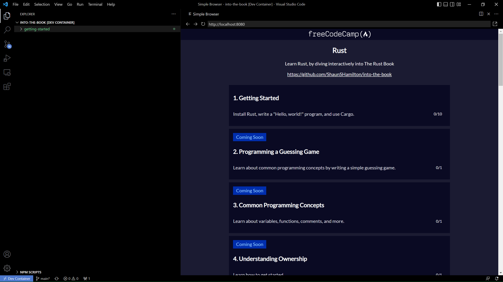
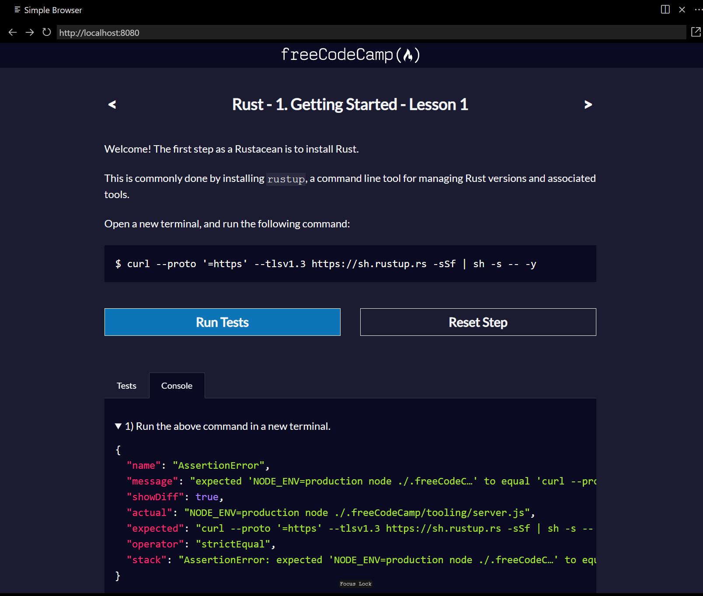

# Into the Book

An interactice curriculum based on [The Rust Book](https://doc.rust-lang.org/book/).





## Getting Started

### Local Development

1. Clone this repository:

```bash
git clone https://github.com/ShaunSHamilton/into-the-book.git
```

2. Open in VSCode:

```bash
cd into-the-book
code .
```

3. Open the command palette (`Ctrl+Shift+P`) and run the command `Dev Containers: Rebuild Container and Reopen in Container`.

4. Once finished, open the command palette again, and run `freeCodeCamp: Run Course`.

5. Choose a course, and follow the instructions 🎉

### With Gitpod

[](https://gitpod.io/#https://github.com/ShaunSHamilton/into-the-book)

1. Once finished, open the command palette again, and run `freeCodeCamp: Run Course`.

2. Choose a course, and follow the instructions 🦀

## Roadmap

<table style="text-align: center;">
  <tr>
    <th>Chapter</th>
    <th colspan="2">Status</th>
  </tr>
  <tr>
    <td colspan="1" rowspan="1"></td>
    <th>Content</th>
    <th>Tests</th>
  <tr>
    <td>Chapter 1</td>
    <td>✅</td>
    <td>✅</td>
 </tr>
  <tr>
    <td><a href="https://github.com/ShaunSHamilton/into-the-book/issues/1">Chapter 2</a></td>
    <td>✅</td>
    <td>❌</td>
  </tr>
  <tr>
    <td><a href="https://github.com/ShaunSHamilton/into-the-book/issues/2">Chapter 3</a></td>
    <td>✅</td>
    <td>❌</td>
  </tr>
  <tr>
    <td><a href="https://github.com/ShaunSHamilton/into-the-book/issues/3">Chapter 4</a></td>
    <td>❌</td>
    <td>❌</td>
  </tr>
  <tr>
    <td><a href="https://github.com/ShaunSHamilton/into-the-book/issues/4">Chapter 5</a></td>
    <td>❌</td>
    <td>❌</td>
  </tr>
  <tr>
    <td><a href="https://github.com/ShaunSHamilton/into-the-book/issues/5">Chapter 6</a></td>
    <td>❌</td>
    <td>❌</td>
  </tr>
  <tr>
    <td><a href="https://github.com/ShaunSHamilton/into-the-book/issues/6">Chapter 7</a></td>
    <td>❌</td>
    <td>❌</td>
  </tr>
  <tr>
    <td><a href="https://github.com/ShaunSHamilton/into-the-book/issues/7">Chapter 8</a></td>
    <td>❌</td>
    <td>❌</td>
  </tr>
  <tr>
    <td><a href="https://github.com/ShaunSHamilton/into-the-book/issues/8">Chapter 9</a></td>
    <td>❌</td>
    <td>❌</td>
  </tr>
  <tr>
    <td>Chapter 10</td>
    <td>❌</td>
    <td>❌</td>
  </tr>
  <tr>
    <td>Chapter 11</td>
    <td>❌</td>
    <td>❌</td>
  </tr>
  <tr>
    <td>Chapter 12</td>
    <td>❌</td>
    <td>❌</td>
  </tr>
  <tr>
    <td>Chapter 13</td>
    <td>❌</td>
    <td>❌</td>
  </tr>
  <tr>
    <td>Chapter 14</td>
    <td>❌</td>
    <td>❌</td>
  </tr>
  <tr>
    <td>Chapter 15</td>
    <td>❌</td>
    <td>❌</td>
  </tr>
  <tr>
    <td>Chapter 16</td>
    <td>❌</td>
    <td>❌</td>
  </tr>
  <tr>
    <td>Chapter 17</td>
    <td>❌</td>
    <td>❌</td>
  </tr>
  <tr>
    <td>Chapter 18</td>
    <td>❌</td>
    <td>❌</td>
  </tr>
  <tr>
    <td>Chapter 19</td>
    <td>❌</td>
    <td>❌</td>
  </tr>
  <tr>
    <td>Chapter 20</td>
    <td>❌</td>
    <td>❌</td>
  </tr>
</table>
